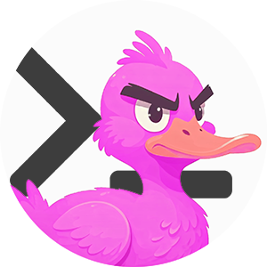

<a name="readme-top"></a>  
[](README-en.md) [](README.md)  
 [](https://github.com/anond0rf/vecchioposter/releases) [](https://goreportcard.com/report/github.com/anond0rf/vecchioposter) [](https://github.com/anond0rf/vecchioposter)  

<br />
<div align="center">
  <a href="https://github.com/anond0rf/vecchioposter">
    
  </a>
<h3 align="center">VecchioPoster</h3>
  <p align="center">
    <strong>VecchioPoster</strong> is a CLI for posting on <a href="https://vecchiochan.com/">vecchiochan.com</a>.
    <br />
    <br />
    <a href="#download"><strong>Get Started »</strong></a>
    <br />
    <br />
    <a href="https://github.com/anond0rf/vecchioposter/releases">Releases</a>
    ·
    <a href="https://github.com/anond0rf/vecchioposter/issues">Report Bug</a>
    ·
    <a href="https://github.com/anond0rf/vecchioposter/issues">Request Feature</a>
  </p>
</div>

## Features

VecchioPoster allows posting on [vecchiochan](https://vecchiochan.com) via command-line.  
The tool abstracts away the details of form submission and request handling through the use of [vecchioclient](https://github.com/anond0rf/vecchioclient).
With the provided commands and options you can:

- Create new threads on specific boards
- Reply to existing threads

Custom `User-Agent` header to be used by the internal client and verbose logging are supported (see [Usage](#usage)).

## Table of Contents

1. [Download](#download)
2. [Usage](#usage)
   - [Creating a Thread](#creating-a-thread)
   - [Posting a Reply](#posting-a-reply)
3. [Building the Project](#building-the-project)
4. [License](#license)

## Download

VecchioPoster is available for Windows, GNU/Linux, and MacOS.  
Binaries for the latest release can be downloaded [here](https://github.com/anond0rf/vecchioposter/releases).

## Usage

Below are examples demonstrating how to use the CLI.  
For simplicity, we assume `vecchioposter` to be the name of the executable.
See the `--help` (`-h`) option for more details.

```sh
vecchioposter -h
```

- #### Creating a Thread

  To create a new thread use the `new-thread` command:

  ```sh
  vecchioposter new-thread -b b -B "This is a new thread on board /b/" -f path/to/file.jpg
  ```

  `--board` (`-b`) is the only **mandatory** flag but keep in mind that, as the settings vary across boards, more flags are probably required for posting (e.g. you can't post a new thread with no embed nor files on /b/).  
  For the list of flags, as well as their short form and command aliases just run

  ```sh
  vecchioposter new-thread -h
  ```

- #### Posting a Reply

  To post a reply use the `post-reply` command:

  ```sh
  vecchioposter post-reply -b b -t 1 -B "This is a reply to thread #1 on board /b/" -f path/to/file1.mp4 -f path/to/file2.webm
  ```

  `--board` (`-b`) and `--thread` (`-t`) are the only **mandatory** flags but keep in mind that, as the settings vary across boards, more flags are probably required for posting (e.g. you can't post a new thread with no embed nor files on /b/).  
  For the list of flags, as well as their short form and command aliases just run

  ```sh
  vecchioposter post-reply -h
  ```

Additional information:
 - For ease of use, a `--msg-file` (`-m`) flag is provided for setting the message body out of a file.

    ```sh
    vecchioposter post-reply -b b -t 1 -m path/to/msg.txt
    ```  
    This reads the content of `msg.txt` and sets it as message body.  
    The flag is is to be used in place of `--body` (`-B`), so you can only use one or the other.  

- For setting a custom User-Agent to be used by the internal client, a `--user-agent` (`-u`) flag is provided:

    ```sh
    vecchioposter new-thread -u "CustomUserAgent" -b b -B "This is a new thread on board /b/" -f path/to/file.jpg
    ```  

- You can enable verbose logging with the  `--verbose` (`-v`) flag:

    ```sh
    vecchioposter new-thread -v -b b -B "This is a new thread on board /b/" -f path/to/file.jpg
    ```  

## Building the Project

To build VecchioPoster from source:

1. Make sure you have [Go](https://golang.org/dl/) installed.
2. Clone the repository with [git](https://github.com/git/git):

   ```sh
   git clone https://github.com/anond0rf/vecchioposter.git
   ```

2. Change directory to the project folder:

   ```sh
   cd vecchioposter
   ```

3. Build the project:

   ```sh
   go build
   ```

An executable file will be produced in the root of the project.

## License

VecchioPoster is licensed under the [LGPL-3.0 License](https://www.gnu.org/licenses/lgpl-3.0.html).  

This means you can use, modify, and distribute the software, provided that any modified versions are also licensed under the LGPL-3.0.  

For more details, please see the full text of the license in the [LICENSE](./LICENSE) file.  

Copyright © 2024 anond0rf
